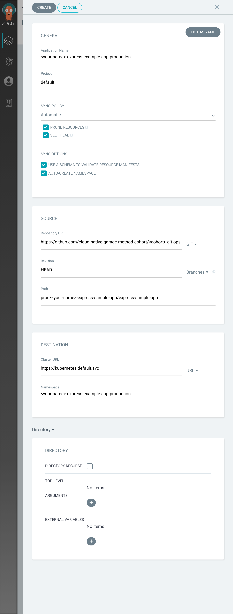
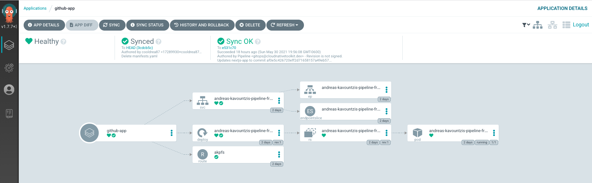
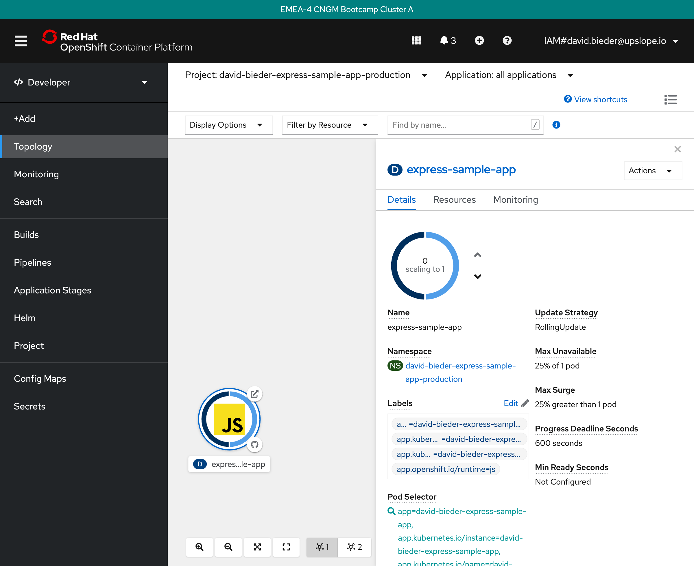

# ArgoCD

## Standards

- Create a sequence diagram of CD with Git-Ops
- Set up an Argo project manually in the UI

## Lesson

We begin with the [Essential Knowledge recommended by ArgoCD](https://argoproj.github.io/argo-cd/understand_the_basics/). ArgoCD's basics have little to do with ArgoCD. As we will see in this lesson, ArgoCD is the simplest portion of our pipeline build because of the principles behind GitOps and Kubernetes.

We will use the [Demo by an ArgoCD Engineer](https://www.youtube.com/watch?v=aWDIQMbp1cc&t=64s) as our inspiration. While the concepts that support ArgoCD are complex, you will notice that ArgoCD itself is not much more than filling out forms since ArgoCD handles the rest.

Recall from GitOps that our goal is the following diagram:


For our purposes, `Operator` is ArgoCD.

In other words, after an uphill battle with Continuous Integration, Continuous Delivery - due to the GitOps Pull-based model - becomes nothing more than "letting the tools do their job." In other words, GitOps' Pull Based model says that an entity should watch the repository for changes, then apply them to the environment automatically which handles consistency itself. ArgoCD makes this simple to use and high leverage as a tool. Like the other tools covered in this course, ArgoCD is new and still rapidly developing.

### Create the production namespace

```
oc new-project <your-name>-express-sample-app-production
```

For example:

```
oc new-project john-doe-express-sample-app-production
```

When you name your project, make sure it is:

- a unique name
- a name that is not equal to the repo name
- a name that is not equal to your pipeline namespace (notice the `-production` extension)

Some good names might be:

```
<your-name>-<repo-name>-production
<squad-name>-<repo-name>-production
```

### Create the Argo App

Click on the nine-box in the OpenShift web console and select `ArgoCD`.

_If you see a browser warning telling your that the **connection is not private,** click on `Advanced` and the `Proceed to argocd-cluster-server-...`. Our course cluster does not have a valid SSL certificate, and you can ignore the warning._

The username is `admin`, and you can get the password by running `oc get secret -n tools argocd-access -o yaml | yq eval '.data.ARGOCD_PASSWORD' - | base64 --decode -` (If you see a `%` at the end, it is not part of the password)

Once you are logged in, click on `+ NEW APP` in the upper left corner of the screen.

Configuring ArgoCD requires little information:



Make sure to replace `<your-name>` with your name and `<cohort>` with your cohort name (e.g. `emea-4`).

Also, verify the `Path` to your `manifest.yaml` in the GitOps repository. If your pipeline uses a different namespace or if you chose a different value for the `app-name` parameter, your path might differ from the path depicted in the screenshot.

Once you are confident that your provided data is correct, hit `CREATE` in the upper left corner of the screen.

## Let ArgoCD do its job

After the setup, click on the app you just created.

All you need do now is to wait for ArgoCD to sync, and eventually you will see a healthy infrastructure:



## Messing around with Production

Let's try to break the production environment.

Go to the OpenShift web console, select the `Developer` view, next select `Topology`, then select the production namespace you just used to create the app in ArgoCD.

Now click on the app `JS` and select the `Details` tab. You should see 1 pod running.

Decrease the pod count to 0.



ArgoCD is watching the production environment and will notice that the desired application state differs from the current application state.

After a few seconds ArgoCD will have started up a new pod and the pod count is 1 again.

## Fast rollbacks

Let's pretend we added a bug that made it into production:

Modify the landing pag of your `express-sample-app` fork and add a "fake" bug:

```bash
cd express-sample-app
echo "p Ah! We have a bug: 🐞" >> views/index.pug
git add view/index.pug
git commit -m "simulate a bug"
git push
```

Wait until your pipeline finished. You can verify that the production environment now has the bug by clicking on the `Open URL` icon in the `Topology` view.

Now that you "discovered" the bug in your production environment, let's roll the last change back.

Thanks to GitOps, this is a relatively simple task and it's quick.

Clone the GitOps repository (or pull the latest changes):

```bash
git clone git@github.com:cloud-native-garage-method-cohort/<cohort>-git-ops.git
cd <cohort>-git-ops
# or git pull
```

Inspect the last commits:

```bash
git log
```

Compare the last commit with the previous commit:

```bash
git diff <second-last-commit-sha>
```

The difference is essentially just the docker image tag.

If you are certain that the last commit introduced the bug, revert it:

```bash
git log
git revert <last-commit-sha>
git log
```

Push your revert of the last commit.

```bash
git push
```

ArgoCD is also watching the GitOps repository, and ArgoCD will notice that the desired application state differs from the current application state. The image tags differ.

After a few seconds ArgoCD will have replaced the app with the older version. Refresh your app in the browser and see for yourself.

Notice that replacing the currently deployed docker image with the previous docker image only took a few seconds. With GitOps you don't have to wait for the build pipeline to re-build the app. You can just take the already existing older (bug-free) docker image.

But keep in mind that your source code still has the bug. Not fixing the bug in the source repository will re-introduce the bug as soon as some other changes are pushed: A new pipeline build is kicked-off, a new image is built (containing the unfixed bug), and the GitOps repo gets updated. Eventually, ArgoCD will see a change and start a new app instance using the newest image (containing the unfixed bug).

## Additional Resources

- [ArgoCD - Issue 2650: namespace not respected when purge-syncing a project via app.kubernetes.io/instance](https://github.com/argoproj/argo-cd/issues/2650)
- [ArgoCD - FAQ: Why Is My App Out Of Sync Even After Syncing?](https://argoproj.github.io/argo-cd/faq/#why-is-my-app-out-of-sync-even-after-syncing)
- [ArgoCD Demo Video](https://www.youtube.com/watch?v=aWDIQMbp1cc&t=64s)
