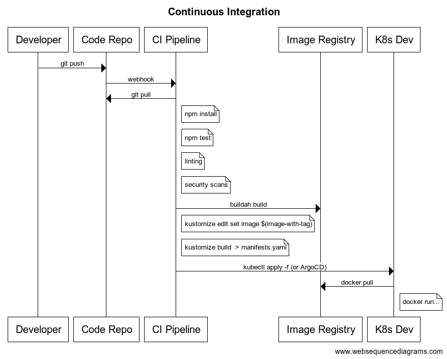

# Continuous Integration / Continuous Deployment

## Standards

- Write a sequence diagram of CI/CD
- Explain the relationship between OpenShift, Tekton, and ArgoCD

## Lesson

Continuous Integration / Continuous Deployment (CI/CD) is an integral practice in DevOps. For this course, "the development of a CI/CD pipeline from first principles" means that we will start from a Git repository with an application and work incrementally towards deploying the application on OpenShift (and in turn Kubernetes) with Tekton and ArgoCD.

CI/CD evolved from a convergence of development practices and technology improvements:

- Test Driven Development (TDD) allows engineers to focus on quality upfront, utilizing a ["Shift Left"](https://en.wikipedia.org/wiki/Shift-left_testing) approach versus traditional deployment methodologies with manual QA cycles after late integration. Since testing happens upfront, rather that right before deployment, issues are caught earlier. Automated testing ensures that testing, as a process, is repeatable.
- Applications have grown in deployment complexity. The growth of microservices as an architecture exposed many challenges including networking, release timing/decoupling of services, and knowing that a set of changes across a disparate group of teams would not have unexpected production outcomes.
- Scalability is now a dynamic, rather than static, concern. Similarly, the means of acquiring/paying for compute resources has fundamentally changed. Many cloud providers offer public services with "pay as you use" pricing which means that companies can scale up/down resources based on demand load.
- Distributed file systems, caches, etc. enable a "treat your infrastructure as cattle not pets" approach to managing infrastructure. This declarative approach also means that deployments work the same way every time, so we minimize potential for human error.

From an ideological standpoint, since the Garage method uses Extreme Programming principles, CI enables fast feedback cycles for integrating changes. We aim to eliminate mistakes through automation, in other words, we can have a fast feedback cycle for change failures (i.e. release rollbacks or roll forwards) in production without having to push to production and see the failure.

What does an actual CI pipeline look like? We can begin at [websequencediagrams.com](https://www.websequencediagrams.com/).

If we want to outline the entire process from Developer to deployed in K8s development environment, it looks like:



which can be replicated with this code for the sequence diagram:

```
title Continuous Integration

participant Developer
participant Code Repo
participant CI Pipeline
participant Image Registry
participant K8s Dev

Developer->Code Repo: git push
Code Repo->CI Pipeline: webhook
CI Pipeline->Code Repo: git pull
note right of CI Pipeline: npm install
note right of CI Pipeline: npm test
note right of CI Pipeline: linting
note right of CI Pipeline: security scans
CI Pipeline->Image Registry: buildah build
note right of CI Pipeline: kustomize edit set image $(image-with-tag)
note right of CI Pipeline: kustomize build  > manifests.yaml
CI Pipeline->K8s Dev: kubectl apply -f (or ArgoCD)
K8s Dev->Image Registry: docker pull
note right of K8s Dev: docker run...
```

We will use Node applications for speed and simplicity throughout this course. One advantage of Node, versus something like Spring, is that is requires significantly less compute resources and time to create/run builds. Since we want fast feedback cycles (and the course is short) we will primarily use this stack.

[Tekton](https://tekton.dev/) is a headless, open source CI/CD pipeline solution for Kubernetes. In particular, from the [documentation](https://tekton.dev/docs/overview/), Tetkon:

> comprises a set of Kubernetes Custom Resources that define the building blocks you can create and reuse for your pipelines. Once installed, Tekton Pipelines becomes available via the Kubernetes CLI (kubectl) and via API calls, just like pods and other resources.

As the documentation notes, the breakdown of role responsibilities is that a:

1. Platform Engineer (or Devops Engineer) builds CI/CD systems and pipelines that are used by teams of developers throughout the organization
1. Cloud Engineer uses the CI/CD systems produced by Platform Engineers

In practice, it's beneficial for both groups to understand the basics, with the branch point beyond this as:

1. Platform Engineer - learns the depth of tools like Tekton, ArgoCD, and works on Platform-wide improvements to systems
1. Cloud Engineer - understands the high level deployment strategy, what benefits and guarantees are present, and how to leverage it to build increasingly complex, cloud native architectures

There are many factors that make the transition to CI/CD complex. Collaboration/pairing of Platform and Cloud Engineers will lead to the best organizational outcomes.

Conceptually, a CI pipeline is some series of steps that transforms an input, the codebase, into an application deployed to a QA or staging environment in the cloud. CI pipelines consist of a series of tasks that must be achieved, sequentially, to get to the cloud. CI pipelines can be thought of as a series of quality gates - if any step in the pipeline fails, then the entire pipeline fails with no code released to the cloud.

In the Tekton world, a `Pipeline` consists of a number of sequential (or parallel) `Tasks` which all must succeed for the code to be promoted.

Conceptually, Continuous Deployment (CD) is the practice of releasing the code as soon as it is ready. While this sounds simple, it is often not.

One modern implementation pattern for CD is [GitOps](https://www.gitops.tech/):

> The core idea of GitOps is having a Git repository that always contains declarative descriptions of the infrastructure currently desired in the production environment and an automated process to make the production environment match the described state in the repository.

We implement GitOps in this course using [ArgoCD](https://argoproj.github.io/argo-cd/). ArgoCD is "a declarative, GitOps continuous delivery tool for Kubernetes." ([source](https://argoproj.github.io/argo-cd/))

In short, a set of YAML files, stored in a Git repository, will provide the desired state of Production. ArgoCD will take the files from our GitOps repository and make sure that the state across the production cluster is consistent with the desired state in the GitOps repo.

Continuous Delivery/Deployment and ArgoCD will be covered later in this course.

To tie it all together:

- Kubernetes is a platform of platforms, based on a declarative, YAML-based syntax that takes as an input the desired state of the cluster and automatically works to make the cluster conform to the desired state
- OpenShift sits on top of Kubernetes and bridges Tekton, ArgoCD, and Kubernetes. OpenShift adds a useful layer of abstraction between its users and Kubernetes. This includes supporting a UI-driven approach to cluster management.
- Tekton is an open source tool for building Kubernetes Continuous Integration pipelines
- ArgoCD is an open source tool for building Kubernetes Continuous Deployment services based on GitOps repositories
