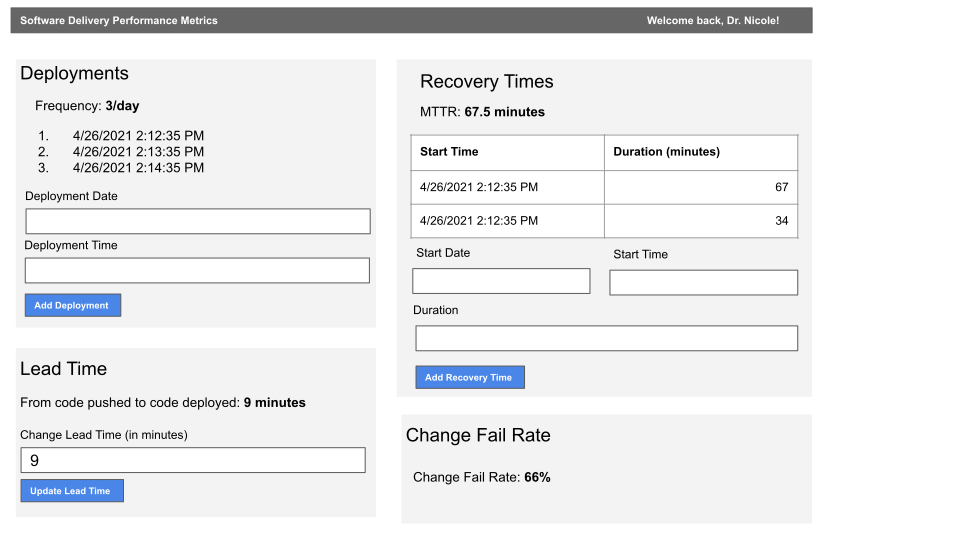

# Prioritize Stories from a Wireframe

## Standards

- Given a wireframe containing many features, provide a value-driven, prioritized backlog

## Lesson

Recall the earlier activity of writing stories for an individual component of the screen. In that case, a single story described the behavior of a single component. When building an actual product, however, it is unlikely that a page will contain a single component. Instead, you will often be presented with [Wireframes](https://www.experienceux.co.uk/faqs/what-is-wireframing/#:~:text=A%20wireframe%20is%20a%20layout,of%20the%20interaction%20design%20process.&text=Wireframes%20can%20also%20be%20used,the%20site%20meets%20user%20expectations.) or [Design Comps](https://thedilldesign.com/web-design-comps-made/) and have to derive what functionality is required of the components.

Typically, a UX Designer provides the visual appearance of the application, and the Product Owner owns the end-to-end user experience and provides the details and specifications of behavior that end up in the story and acceptance criteria.

For this lesson, as a Squad, you will act as the Product Owner and use the following Wireframe to create stories:

Is anything missing? If so, how would your Squad, as a collective Product Owner, decide to have it work? What seems reasonable?

As a Squad you must also prioritize the stories in such a manner that a Development team could begin working on the backlog and produce a coherent product, from scratch, delivering the highest client value possible.

### User Stories are not requirements

When developers receive user stories and wireframes, they should not assume that the Wireframe or story are complete and final. Developers often need more detailed information than what is typically specified in a user story or wireframe. For example, a Developer may ask questions like "how many decimal places should this value show in the extreme case," and this level of detail is typically not included in wireframes. For the best user experience, it is critical for Developers to ask Product Owners and Designers questions about boundary conditions, intent, implementation, and other functionality that is not specified in the user story.
