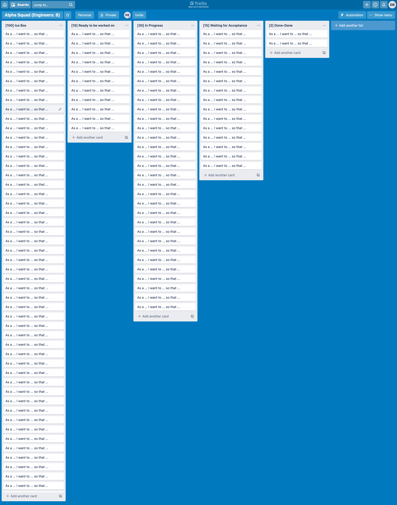
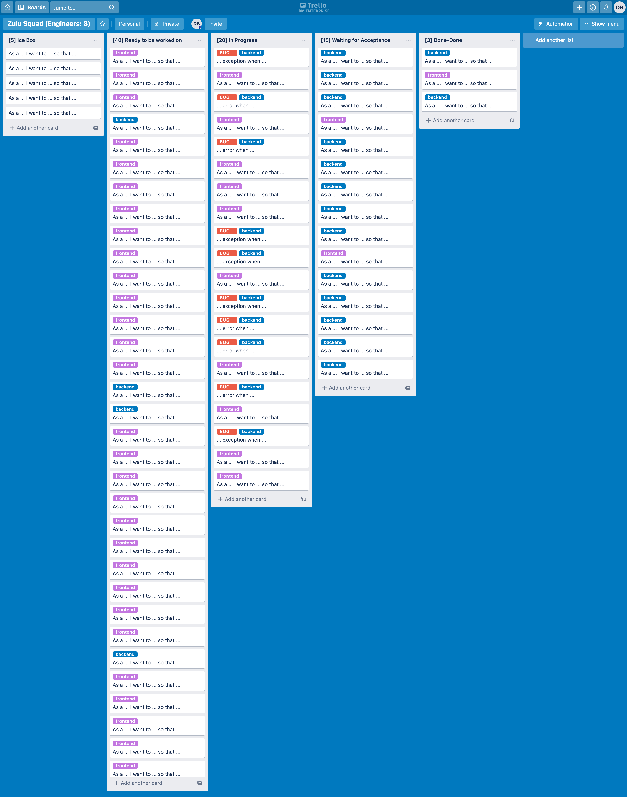

# Project Tracker Analysis

## Standards

- Given information about a team's project tracker, explain what is happening and how the team fixes it via the Garage Method

## Lesson

In this lesson, you will work with your squad to determine a Garage Method-based recommendation, based on a description of the team's project tracker, for each of the following scenarios:

1. Alpha Squad - This squad has eight (8) developers, resulting in four (4) pairs. This squad's tracker has a lot of items in the Ice Box, _but every team does, right? It's the nature of product work._ The squad's Product Owner is part of a Product Management Organization (PMO), separate from IT in the Organization Chart. The PO is split between multiple teams. The result is that sometimes it is hard to get answers on detailed questions. The team's [project tracker](project-tracker-1.png) contains:

   - 100 stories in the "Ice Box" (for future)
   - 10 stories in "Ready to be worked on"
   - 30 stories in "In Progress"
   - 15 stories in "Waiting for Acceptance"

   Given this tracker, what is going on with this team? How do you advise this team use the Garage Method?

2. Zulu Squad - Your client has determined that backend and frontend are fundamentally different skill sets and should therefore not require each other. That is, a front end engineer should be able to work independently of back end engineer availability and vice versa. Many features appear to fail in production. The team's [project tracker](project-tracker-2.png) contains:

   - 5 stories in the "Ice Box" (for future)
   - 40 stories in "Ready to be worked on", most with `tag: front-end`
   - 10 stories in "In Progress", most with `tag: frontend`
   - 10 bugs in "In Progress", most with `tag: backend`
   - 15 stories in "Waiting for Acceptance"

   Given this tracker, what is going on with this team? How do you advise this team use the Garage Method?

