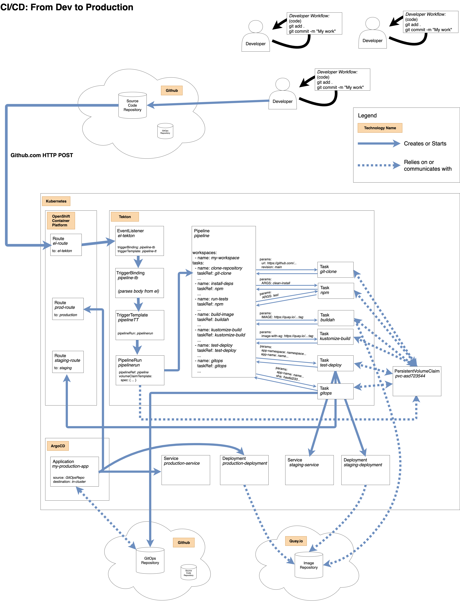

# Check In on Progress

We have the "Complete Picture" of CI/CD:

- Git - source control for code
- Quay.io - image repository
- Kubernetes - container orchestration and management layer
- Tekton - CI/CD natively built for Kubernetes
- Git - used to store the GitOps repository
- ArgoCD - GitOps CD tool natively built for Kubernetes

