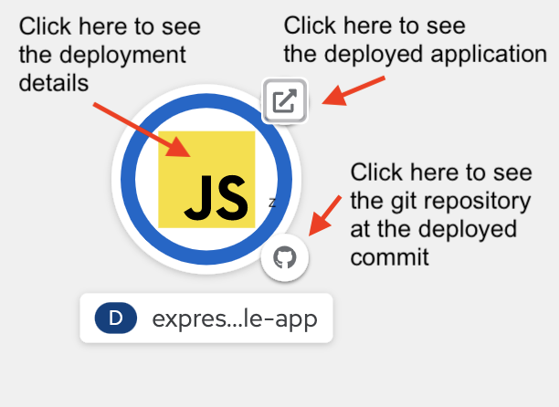

# Tekton Pipeline Build - Kustomize

## Standards

- Customize a build configuration using Kustomize.
- Verify the customized build configuration by deploying the application to a QA environment.

## Starting point

This lesson continues to build upon the earlier lessons, so the starting point for this lesson is the state of the Pipeline after adding `buildah`:

You have the following folder structure:

- `base/`
  - [`build-bot.ServiceAccount.yaml`](./starting-point/base/build-bot.ServiceAccount.yaml)
  - [`nodejs.Pipeline.yaml`](./starting-point/base/nodejs.Pipeline.yaml)
  - [`quay-io-credentials.Secret.yaml`](./starting-point/base/quay-io-credentials.Secret.yaml)
- [`express-sample-app.PipelineRun.yaml`](./starting-point/express-sample-app.PipelineRun.yaml)

## Lesson

Next, you will use [Kustomize](https://kustomize.io/) to build your Kubernetes configuration. Kustomize is a tool for customizing Kubernetes YAML configuration files.

In the [repository you are deploying](https://github.com/upslopeio/express-sample-app/) there is a `k8s` folder with the requisite files for Kustomize.

Kustomize can be a rather confusing tool, so you will look at the repository locally.

```shell
$:> cd ~/workspace
$:> git clone git@github.com:<your-account>/express-sample-app.git
$:> code ~/workspace/express-sample-app
```

Since there is no Tekton Catalog task for Kustomize, you will construct your own Task, doing the development for this locally will help you get a better understanding of Kustomize.

Review the `kustomize.yaml` in the `k8s` folder:

```yaml
apiVersion: kustomize.config.k8s.io/v1beta1
kind: Kustomization
resources:
  - deployment.yaml
  - service.yaml
  - route.yaml
```

Note that the `resources` section references three other YAML files in the same folder (you will look at those shortly).

Next, open `deployment.yaml` and notice the labels in the `spec.template.metadata.labels` field.

Then, open `service.yaml` and notice that matching labels are specified in the `spec.selector` field. A Service is an abstract way to expose an application running on a set of Pods as a network service. The set of Pods targeted by a Service is usually determined by specifying matching labels in the selector. The Service targets any Pod with labels that match the selector.

While you won't have time to learn all about [Kubernetes Labels and Selectors](https://kubernetes.io/docs/concepts/overview/working-with-objects/labels/) you will need them for the Service to target the correct pods and for the OpenShift Developer Perspective Topology View to display links to a specific commit in your GitHub repository.

> You might want to review the [Common labels](https://kubernetes.io/docs/concepts/overview/working-with-objects/common-labels/) used in Kubernetes.

You will do three things with Kustomize:

1. Swap out the image declared in `deployment.yaml` (`quay.io/upslopeio/express-sample-app`) for the one tagged with the SHA of the GitHub commit for which your Pipeline is running, and
2. Change the `app`, `app.kubernetes.io/instance`, and `app.kubernetes.io/name` labels with values that are more specific to your application than the existing values and update the Service selector to use the updated label values.
3. Add `app.openshift.io/vcs-uri`, and `app.openshift.io/vcs-uri` annotations used by the OpenShift Topology View.

There are some other values that you will swap out in a production pipeline, like the `app.kubernetes.io/version` or `app.kubernetes.io/part-of`, but this is omitted from this exercise to keep the example short.

Working with the `express-sample-app` repository locally will allow you to tackle each task in order and observe the expected result:

### Set the image value

Looking at the documents for [`images`](https://kubectl.docs.kubernetes.io/references/kustomize/kustomization/images/) you see that you set an image tag with `kustomize edit set image`, relying on a parameter provided to the task that includes the SHA

The `kustomize edit set image` command will only modify the `kustomization.yaml` file to include the new image information. Later, you will run `kustomize build` to actually update the resource files included in `kustomization.yaml`.

When setting the image value using Kustomize, you must specify the existing value to replace with a new value in the `existing-value=new-value` format.

To replace an existing image value, pass a key=value pair to `kustomize edit set image` like the following:

```shell
cd k8s
IMAGE_SHA="bdc9ad410080aec4a5b8efe656511340a0fa4605"
kustomize edit set image quay.io/upslopeio/express-sample-app=quay.io/<your-account>/express-sample-app:${IMAGE_SHA}
```

Note the `=` included in the value passed to `kustomize edit set image`. This command will set the image to the _new_ value _only_ if the existing value is `quay.io/upslope/express-sample-app`, any other image property will remain unchanged. The ability to replace specific image values allows you to Kustomize configurations that contain multiple images.

Now run `git diff` and you should see something like the following:

```diff
...
+images:
+- name: quay.io/upslope/express-sample-app
+  newName: quay.io/<your-quay-io-user-name>/express-sample-app
+  newTag: bdc9ad410080aec4a5b8efe656511340a0fa4605
```

If you want to update all images, you can use the `*` wildcard like the following:

```shell
IMAGE_SHA="d90c742ee626048c4d1e2032eb836255e4036561"
kustomize edit set image *=quay.io/<your-account>/express-sample-app:${IMAGE_SHA}
```

### Set the labels

To set the labels you need for the Topology View to appear coherently, you will use `kustomize edit set label`.

Unlike `set image`, `kustomize edit set label` does not allow replacing matching values. `set label` is for setting labels that apply to every resource file specified in the `kustomization.yaml`.

```shell
$:> git restore kustomization.yaml
kustomize edit set label "app.kubernetes.io/instance:express-sample-app"
kustomize edit set label "app.kubernetes.io/name:express-sample-app"
```

Then run `git diff` to see the changes to `kustomization.yaml`.

Next, define a custom Tekton Task in `create-configuration.Task.yaml`:

```yaml
apiVersion: tekton.dev/v1beta1
kind: Task
metadata:
  name: create-configuration
spec:
  params:
    - name: app-name
      description: the name of the app
    - name: commit
      description: The precise commit SHA used for this task
    - name: image-repo
      description: contains the full image repository (without :tag)
    - name: source-repo
      description: Source git repository
  results:
    - name: manifest
      description: The path to the yaml file
  steps:
    - name: create-manifest
      image: quay.io/upslopeio/kustomize:latest
      script: |
        #!/bin/sh
        set -e

        trap 'catch $? $LINENO' EXIT

        catch() {
          if [ "$1" != "0" ]; then
            echo "Error $1 occurred on $2"
          fi
        }

        cd source/k8s

        if [ -f kustomization.yaml ] || [ -f kustomization.yml ] || [ -f Kustomization ]; then
          echo "Kustomization file found."
        else
          echo "Error: unable to find one of 'kustomization.yaml', 'kustomization.yml' or 'Kustomization' in folder:"
          pwd
          exit 1
        fi

        kustomize edit set image "*=$(params.image-repo):$(params.commit)"

        kustomize edit set label "app.kubernetes.io/instance:$(params.app-name)"
        kustomize edit set label "app.kubernetes.io/name:$(params.app-name)"

        kustomize edit add annotation "app.openshift.io/vcs-uri:$(params.source-repo)"
        kustomize edit add annotation "app.openshift.io/vcs-ref:$(params.commit)"

        kustomize build > manifest.yaml

        if [ -f manifest.yaml ]; then
          echo "manifests.yaml successfully generated"
          echo "contents of manifests is:"
          cat manifest.yaml
        else
          echo "ERROR: manifest.yaml not generated"
          exit 1
        fi
    - name: manifest-to-results
      image: quay.io/upslopeio/kustomize:latest
      script: |
        echo -n "k8s/manifest.yaml" > $(results.manifest.path)
  workspaces:
    - name: source
      description: contains the cloned git repo
```

then, add the new task to your pipeline by making the following changes:

```yaml
apiVersion: tekton.dev/v1beta1
kind: Pipeline
metadata:
  name: nodejs
spec:
  params:
    - name: app-name
      type: string
      description: Application name
    - name: source-repo
      # ...
    - name: image-repo
      # ...
  tasks:
    - name: clone-repository
      # ...
    - name: run-tests
      # ...
    - name: create-image
      # ...
    - name: create-configuration
      params:
        - name: app-name
          value: "$(params.app-name)"
        - name: source-repo
          value: "$(params.source-repo)"
        - name: commit
          value: "$(tasks.clone-repository.results.commit)"
        - name: image-repo
          value: "$(params.image-repo)"
      runAfter:
        - create-image
      taskRef:
        name: create-configuration
      workspaces:
        - name: source
          workspace: pipeline-shared-data
  workspaces:
    - name: pipeline-shared-data
```

Adding the new `create-configuration` task to the pipeline involved adding a new parameter `app-name`. You need to provide a value for this new parameter in the PipelineRun:

```yaml
apiVersion: tekton.dev/v1beta1
kind: PipelineRun
metadata:
  generateName: express-sample-app-
spec:
  serviceAccountName: build-bot
  params:
    - name: app-name
      value: express-sample-app
    - name: source-repo
      value: https://github.com/<your-account>/express-sample-app
    - name: image-repo
      value: quay.io/<your-account>/express-sample-app
  pipelineRef:
    name: nodejs
  workspaces:
    - name: pipeline-shared-data
      # ...
```

Next, you need a way to verify that the updated configuration works correctly, so you will deploy your application to a "lower environment" in your cluster. The production deployment will be handled in a later step.

To do this you will deploy the application using `kubectl apply -f` from another custom, Tekton Task:

in `deploy.Task.yaml`

```yaml
apiVersion: tekton.dev/v1beta1
kind: Task
metadata:
  name: deploy
spec:
  params:
    - name: app-namespace
      description: namespace for the deployment
    - name: manifest
      description: the relative path to the manifest file.
  results:
    - name: deployment-name
      description: the metadata.name of the deployment
  steps:
    - name: deploy
      image: quay.io/upslopeio/kubectl:latest
      script: |
        #!/bin/sh
        set -e

        kubectl apply -n $(params.app-namespace) -f ./source/$(params.manifest) --validate=false
    - name: verify-deploy
      image: quay.io/upslopeio/kubectl:latest
      script: |
        #!/bin/sh
        set -e

        trap 'catch $? $LINENO' EXIT

        catch() {
          if [ "$1" != "0" ]; then
            echo "Error $1 occurred on $2"
          fi
        }

        MANIFEST=$(params.manifest)

        if [[ -z "${MANIFEST}" ]]; then
           echo "Manifest path not set"
           exit 1
        fi

        DEPLOYMENT_NAME=$(yq eval 'select(.kind == "Deployment").metadata.name' "./source/$MANIFEST" )

        if [[ -z "${DEPLOYMENT_NAME}" ]]; then
           echo "Unable to determine deployment name"
           exit 1
        fi

        echo "Waiting for rollout of deployment/${DEPLOYMENT_NAME} in $(params.app-namespace)"

        kubectl rollout status -w deployment/${DEPLOYMENT_NAME} -n $(params.app-namespace)

        echo -n "DEPLOYMENT_NAME" > $(results.deployment-name.path)
  workspaces:
    - name: source
      description: contains the cloned git repo
```

Next, add this Task to the pipeline in `nodejs.Pipeline.yaml`:

```yaml
apiVersion: tekton.dev/v1beta1
kind: Pipeline
metadata:
  name: nodejs
spec:
  # ...
  tasks:
    - name: clone-repository
      # ...
    - name: run-tests
      # ...
    - name: create-image
      # ...
    - name: create-configuration
      # ...
    - name: deploy
      params:
        - name: manifest
          value: "$(tasks.create-configuration.results.manifest)"
        - name: app-namespace
          value: "$(context.pipelineRun.namespace)"
      runAfter:
        - create-configuration
      taskRef:
        name: deploy
      workspaces:
        - name: source
          workspace: pipeline-shared-data
  workspaces:
    - name: pipeline-shared-data
```

**Note** that `$(context.pipelineRun.namespace)` is one of the [variable substitutions supported by Tasks and Pipelines](https://tekton.dev/docs/pipelines/variables/)

Once run, this pipeline generates the following error:

```shell
[test-deploy : deploy] Deploying into: <your-name>-express-sample-app
[test-deploy : deploy] Error from server (Forbidden): error when retrieving current configuration of:
[test-deploy : deploy] Resource: "apps/v1, Resource=deployments", GroupVersionKind: "apps/v1, Kind=Deployment"
[test-deploy : deploy] Name: "express-sample-app", Namespace: "  <your-name>-express-sample-app"
[test-deploy : deploy] from server for: "./manifests.yaml": deployments.apps "  <your-name>-pipeline-from-scratch" is forbidden: User "system:serviceaccount:  <your-name>-pipeline-from-scratch:build-bot" cannot get resource "deployments" in API group "apps" in the namespace "  <your-name>-express-sample-app"
[test-deploy : deploy] Error from server (Forbidden): error when retrieving current configuration of:
[test-deploy : deploy] Resource: "route.openshift.io/v1, Resource=routes", GroupVersionKind: "route.openshift.io/v1, Kind=Route"
[test-deploy : deploy] Name: "  express-sample-app", Namespace: "  <your-name>-express-sample-app"
[test-deploy : deploy] from server for: "./manifests.yaml": routes.route.openshift.io "  express-sample-app" is forbidden: User "system:serviceaccount:  <your-name>-express-sample-app:build-bot" cannot get resource "routes" in API group "route.openshift.io" in the namespace "  <your-name>-express-sample-app"

failed to get logs for task test-deploy : container step-deploy has failed  : [{"key":"StartedAt","value":"2021-05-24T01:20:51.703Z","resourceRef":{}}]
```

which is solved by creating a new `Role` (`"deployer"`) and `RoleBinding` to the `build-bot` service account, which gives it access to the requested resources.

Add the following to `build-bot.ServiceAccount.yaml`

```yaml
# ...
---
apiVersion: rbac.authorization.k8s.io/v1
kind: Role
metadata:
  name: deployer
rules:
  - resources:
      - deployments
    apiGroups:
      - apps
    verbs:
      - get
      - create
      - list
      - patch
      - watch
  - resources:
      - routes
    apiGroups:
      - route.openshift.io
    verbs:
      - get
      - create
      - patch
  - resources:
      - services
    apiGroups:
      - ""
    verbs:
      - get
      - patch
      - create
---
apiVersion: rbac.authorization.k8s.io/v1
kind: RoleBinding
metadata:
  name: deployer
roleRef:
  name: deployer
  kind: Role
  apiGroup: rbac.authorization.k8s.io
subjects:
  - name: build-bot
    kind: ServiceAccount
```

Then, provide values for the new parameter in the `PipelineRun`, which should now look like the following:

```yaml
apiVersion: tekton.dev/v1beta1
kind: PipelineRun
metadata:
  generateName: express-sample-app-
spec:
  serviceAccountName: build-bot
  params:
    - name: app-name
      value: express-sample-app
    # ...
  # ...
```

Next, you can see that your pipeline works correctly with an `oc apply -f` / `oc create -f` / `tkn pr logs -f` cycle.

To see the deployed application in the cloud, we open the OpenShift Console with `oc console`. Select "Developer View," then "Topology," then you should see the following:



Click on the link and make sure that your application is running.

## Kustomize the pipeline

You may recall that you had to manually install the `npm` task when you first started working on the Pipeline.

Having a dependency on a file hosted on hub.tekton.com means that it is highly likely you will forget to install the task when you move to a new OpenShift project.

Fortunately, you can use Kustomize to make sure that external dependencies are automatically installed.

Next, create `~/workspace/nodejs-pipeline/base/kustomization.yaml` with the following contents:

```yaml
apiVersion: kustomize.config.k8s.io/v1beta1
kind: Kustomization
resources:
  - https://raw.githubusercontent.com/tektoncd/catalog/main/task/npm/0.1/npm.yaml
```

Next, use the kustomize cli took to add all the yaml files in the base folder by running the following:

```shell
cd ~/workspace/nodejs-pipeline/base
kustomize edit add resource *.yaml
cd ..
```

Now, you can run `kubectl apply -k base` rather than `oc apply -f base`

> Note: `oc apply -k base` may produce the following error:
>
> `... /base/https:: no such file or director`
>
> If this happens, it is because `oc` is delegating to an older version of `kubectl` that shipped with `oc`

Going forward, when you create a new file you should also add the file to the `resources` listed in `kustomization.yaml`
