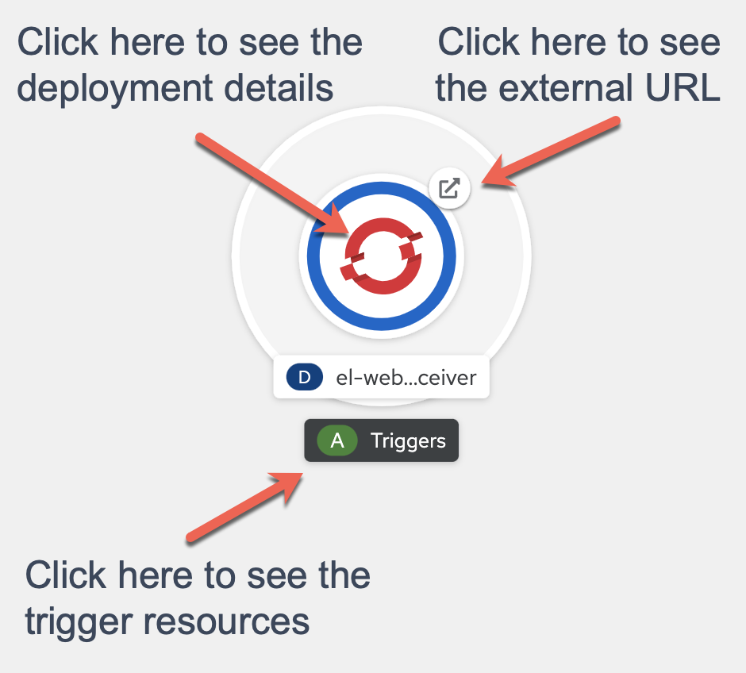

# Tekton Pipeline Build - Build Triggers

## Standards

- Trigger a `PipelineRun` by a Git push to the repository.

## Starting point

This lesson continues to build upon the earlier lessons, so the starting point for this lesson is the following:

You have the following folder structure:

- `base/`
  - [`build-bot.ServiceAccount.yaml`](./starting-point/base/build-bot.ServiceAccount.yaml)
  - [`create-configuration.Task.yaml`](./starting-point/base/create-configuration.Task.yaml)
  - [`deploy.Task.yaml`](./starting-point/base/deploy.Task.yaml)
  - [`kustomization.yaml`](./starting-point/base/kustomization.yaml)
  - [`nodejs.Pipeline.yaml`](./starting-point/base/nodejs.Pipeline.yaml)
  - [`quay-io-credentials.Secret.yaml`](../04-kustomize/starting-point/base/quay-io-credentials.Secret.yaml) You will need to add your credentials to this file.
- [`express-sample-app.PipelineRun.yaml`](./starting-point/express-sample-app.PipelineRun.yaml)

## Lesson

So far you have used `oc create -f express-sample-app-pipeline-run.yaml` since it is a convenient mechanism for developing and debugging the pipeline. The final step in the CI part of our Pipeline is to automate the creation of each `PipelineRun`.

[Tekton Triggers](https://github.com/tektoncd/triggers/blob/main/docs/README.md) gives you a way to listen to and extract data from events. The data in the event is then used to determine if a `PipelineRun` should be created and with what input values.

The event that you are interested in, is a `push` to a GitHub repository. GitHub, as a provider, allows you to configure [webhooks](https://docs.github.com/en/developers/webhooks-and-events/webhooks/about-webhooks) which you will use for this purpose.

Conceptually, a **`Trigger`** specifies what happens when the `EventListener` receives an event. A `Trigger` specifies a `TriggerTemplate`, a `TriggerBinding`, and optionally, an `Interceptor`.

The [documentation](https://github.com/tektoncd/triggers/blob/main/docs/README.md#how-does-triggers-work) explains the entities we will need to create:

- **`EventListener`** - listens for events at a specified port on your Kubernetes cluster. Specifies one or more Triggers.

- **`TriggerTemplate`** - specifies a blueprint for the resource, such as a TaskRun or PipelineRun, to execute when your EventListener receives an event. It exposes parameters that you can use anywhere within your resource's template.

- **`TriggerBinding`** - specifies the fields in the event payload from which you want to extract data and the fields in your corresponding TriggerTemplate to populate with the extracted values. You can then use the populated fields in the TriggerTemplate to populate fields in the associated TaskRun or PipelineRun.

You will follow the general approach outlined in [this getting started guide](https://github.com/tektoncd/triggers/blob/main/docs/getting-started/README.md). However, the following configuration varies slightly from the guide as a result of debugging an error encountered while writing this content. (Process documented below for the curious).

### Event Listener

First, you will add an `EventListener`

The `base/webhook-receiver.EventListener.yaml` file should contain the following:

```yaml
apiVersion: triggers.tekton.dev/v1alpha1
kind: EventListener
metadata:
  name: webhook-receiver
spec:
  serviceAccountName: webhook-receiver
  triggers:
    - template:
        name: webhook-receiver
      bindings:
        - ref: webhook-receiver
```

The above yaml defines an [EventListener](https://tekton.dev/vault/triggers-v0.6.1/eventlisteners/), which is a declarative way to process incoming HTTP based events with JSON payloads (e.g.; GitHub Webhooks)

> Note: Add `webhook-receiver.EventListener.yaml` to the resources listed in `Kustomization.yaml`

### Trigger Template

Since you have a Pipeline already, you need to create a `TriggerTemplate` to run your `Pipeline` from a `git push`. The `TriggerTemplate` specifies a blueprint for the `PipelineRun` to execute when a `git push` occurs:

next you will add a `TriggerTemplate`, that will be used by the EventListener to run the Pipeline:

```yaml
# ...
---
apiVersion: triggers.tekton.dev/v1alpha1
kind: TriggerTemplate
metadata:
  name: webhook-receiver
spec:
  resourcetemplates:
    - apiVersion: tekton.dev/v1beta1
      kind: PipelineRun
      metadata:
        generateName: express-sample-app-
      spec:
        serviceAccountName: build-bot
        params:
          - name: app-name
            value: express-sample-app
          - name: image-repo
            value: quay.io/<your-account>/express-sample-app
          - name: source-repo
            value: https://github.com/<your-account>/express-sample-app.git
        pipelineRef:
          name: nodejs
        workspaces:
          - name: pipeline-shared-data
            volumeClaimTemplate:
              spec:
                resources:
                  requests:
                    storage: 1Gi
                accessModes:
                  - ReadWriteOnce
```

> Note that the first entry of `resourcetemplates` is an exact copy of our the `PipelineRun` we used so far.

### Trigger Binding

Next you configure the `TriggerBinding` which is just a mapping of the webhook payload to parameters:

```yaml
# ...
---
apiVersion: triggers.tekton.dev/v1alpha1
kind: TriggerBinding
metadata:
  name: webhook-receiver
```

> Note that the TriggerBinding is not doing anything at all at the moment. We will improve that later in this lesson.

The separation of `TriggerBindings` from `TriggerTemplates` was deliberate to encourage reuse between them.

### Role

next you add a `Role` with enough permissions to do everything the webhook receiver needs:

```yaml
# ...
---
apiVersion: rbac.authorization.k8s.io/v1
kind: Role
metadata:
  name: webhook-receiver
rules:
  - resources:
      - eventlisteners
      - triggerbindings
      - triggertemplates
    apiGroups:
      - triggers.tekton.dev
    verbs:
      - get
  - resources:
      - pipelineruns
      - pipelineresources
    apiGroups:
      - tekton.dev
    verbs:
      - create
  - resources:
      - configmaps
    apiGroups:
      - ""
    verbs:
      - list
```

### Service Account

Next, you create a `ServiceAccount` to handle the triggers.

```yaml
# ...
---
apiVersion: v1
kind: ServiceAccount
metadata:
  name: webhook-receiver
```

next, you bind the `Role` to the `ServiceAccount`:

```yaml
# ...
---
apiVersion: rbac.authorization.k8s.io/v1
kind: RoleBinding
metadata:
  name: webhook-receiver
roleRef:
  name: webhook-receiver
  kind: Role
  apiGroup: rbac.authorization.k8s.io
subjects:
  - name: webhook-receiver
    kind: ServiceAccount
```

### Route

Now, you need a way to route traffic to the `EventListener`, so add a `Route`:

```yaml
# ...
---
apiVersion: route.openshift.io/v1
kind: Route
metadata:
  name: webhook-receiver
spec:
  port:
    targetPort: 8080
  to:
    name: el-webhook-receiver
    kind: Service
    weight: 100
```

> Note: the service name is `el-webhook-receiver` while the `metadata.name` of the `EventListener` is `webhook-receiver`. The `el-` prefix is added automatically by OpenShift.

Under normal circumstances the `Route` for `webhook-receiver` would not be exposed on the public internet in this way. It would typically be only available on the company intranet or perhaps be secured in some way to prevent unauthorized use of the webhook.

Now run `kubectl apply -k base` to add the webhook-receiver to the cluster. Next, check the topology view to see that the `webhook-receiver` is deployed and running. You should see something like the following:



### GitHub Webhook

Next, in the GitHub UI, under Settings, Webhooks, you will configure a webhook to call the event listener URL, which is retrieved from the topology view or with `oc get route / oc describe route`.

Finally, modify the `k8s/deployment.yaml` file in your project by adding a `app.openshift.io/runtime` label:

```yaml
kind: Deployment
metadata:
  labels:
    app.openshift.io/runtime: js
  name: express-sample-app
spec:
```

Commit and push this change to your repository to trigger a PipelineRun.

Another approach to the security aspect is to use [Deploy Keys](https://docs.github.com/en/developers/overview/managing-deploy-keys).

### Building specific Commit IDs

If you look at the pipeline `yaml` you will notice, that there is no mention of `express-sample-app`. Only the `PipelineRun` and now the `TriggerTemplate` mention the specific app and repository that should be built and deployed.

That makes the pipeline reusable. It is a generic pipeline that can be used to build and deploy most Node.js projects.

However, there's one improvement we can make. Currently, the pipeline will always build the latest commit of the repository to clone. Sometimes it can be useful to build a specific commit or even a commit from a fork.

The good news: the GitHub trigger event has all the information about the push that caused the event on board. There's a repository url and commit id.

Let's improve our pipeline by extracting the repository url and the commit id out of the trigger event payload:

```yaml
# ...
---
apiVersion: triggers.tekton.dev/v1alpha1
kind: TriggerBinding
metadata:
  name: webhook-receiver
spec:
  params:
    - name: source-repo
      value: $(body.repository.url)
    - name: sha
      value: $(body.head_commit.id)
---
# ...
```

Next, let's use the payload information and pass it as params to the pipeline:

```yaml
# ...
---
apiVersion: triggers.tekton.dev/v1alpha1
kind: TriggerTemplate
metadata:
  name: webhook-receiver
spec:
  params:
    - name: source-repo
      description: Source code repository
    - name: sha
      description: Precise SHA of the commit to build
  resourcetemplates:
    - apiVersion: tekton.dev/v1beta1
      kind: PipelineRun
      metadata:
        generateName: express-sample-app-
      spec:
        serviceAccountName: build-bot
        params:
          # ...
          - name: source-repo
            value: $(tt.params.source-repo)
          - name: sha
            value: $(tt.params.sha)
        # ...
---
# ...
```

The pipeline already supports `source-repo`, but the new `sha` param is not yet supported. Let's change that:

```yaml
apiVersion: tekton.dev/v1beta1
kind: Pipeline
metadata:
  name: nodejs
spec:
  params:
    # ...
    - name: sha
      type: string
      default: ""
      description: Precise SHA of the commit to build
  tasks:
    - name: clone-repository
      params:
        - name: url
          value: "$(params.source-repo)"
        - name: revision
          value: "$(params.sha)"
      # ...
```

Now the pipeline will clone the source repository and checkout the commit id (a.k.a revision or SHA) mentioned in the trigger event.
