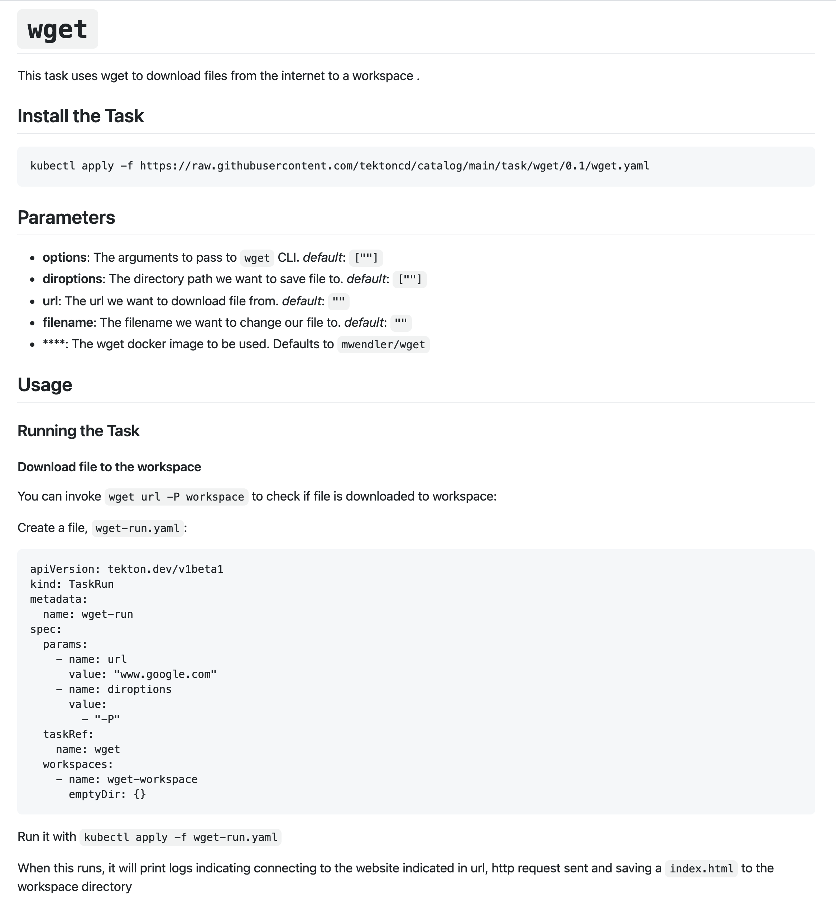

# Tekton Catalog

## Standards

- Use the Task Catalog to run `Tasks`

## Starting point

This lesson continues to build upon the earlier lessons, so the starting point for this lesson is the state of the Pipeline after adding `buildah`:

You have the following folder structure:

- [`download.Task.yaml`](./starting-point/download.Task.yaml)
- [`download.TaskRun.yaml`](./starting-point/download.TaskRun.yaml)

## Lesson

A major benefit of the Tekton ecosystem is [tekton/catalog](https://github.com/tektoncd/catalog) and its graphical viewer, [Tekton Hub](https://hub.tekton.dev/).

The Tekton Catalog consists of community maintained `Tasks` that are reusable. Recently `Pipelines` have been added as well with plans for future expansion. [The Catalog also offers replacement for the `v1alpha1` feature, `PipelineResources`](https://github.com/tektoncd/pipeline/blob/main/docs/migrating-v1alpha1-to-v1beta1.md#replacing-pipelineresources-with-tasks).

We will use the Tekton Catalog, as much as possible, to build our pipeline. We do this to gain exposure to how flexible Tekton is, how powerful the Catalog is in terms of reuse, and for reducing our effort. Building CI pipelines is different for every application stack, so having "plug and play" open source `Tasks` for our pipeline saves time.

Most tasks will only make sense in the context of a pipeline. There are a handful of standalone tasks that we can use. For this lesson, we will use [wget](https://github.com/tektoncd/catalog/tree/main/task/wget/0.1). `wget` is a CLI tool for downloading files from the internet.

Starting at the documentation:



First, confirm we are operating against the correct cluster context:

```shell
$:> oc config current-context
```

Next, we install the task in the current namespace:

```shell
$:> kubectl apply -f https://raw.githubusercontent.com/tektoncd/catalog/main/task/wget/0.1/wget.yaml
task.tekton.dev/wget created
```

The Parameters listed all have default values and are therefore optional, so we ignore them to begin.

The `wget` Task defines parameters so to use it, we can simply create a `TaskRun` definition:

```yaml
apiVersion: tekton.dev/v1beta1
kind: TaskRun
metadata:
  name: wget-run
spec:
  params:
    - name: url
      value: "www.google.com"
    - name: diroptions
      value:
        - "-P"
  taskRef:
    name: wget
  workspaces:
    - name: wget-workspace
      emptyDir: {}
```

One important detail in this TaskRun spec is the workspace declaration:

```yaml
workspaces:
  - name: wget-workspace
    emptyDir: {}
```

The workspace named `wget-workspace` declares the volume type as [`emtpyDir`](https://kubernetes.io/docs/concepts/storage/ephemeral-volumes/). Kubernetes creates `emptyDir` as the Pod's ephemeral storage volume at the time of Pod creation. Here we leverage that characteristic of Kubernetes Pods for a temporary file system during the `TaskRun`.

Apply this to the cluster:

```shell
$:> oc apply -f wget-task-run.yaml
taskrun.tekton.dev/wget-run created
```

Find the Pod that completed the `TaskRun`:

```shell
$:> oc get pods
NAME                                            READY   STATUS             RESTARTS   AGE
nginx-deployment-66b6c48dd5-nwfsj               0/1     CrashLoopBackOff   20         79m
nginx-deployment-66b6c48dd5-r4jdx               0/1     CrashLoopBackOff   20         79m
tekton-task-assignment-run-c5vk7-pod-zh68t      0/4     Completed          0          2d
tekton-task-assignment-run-vkk8v-pod-9jpvp      0/4     Error              0          2d
wget-run-pod-mvjzs                              0/1     Completed          0          2m57s
```

See the output of the successful `TaskRun` via the Pod's logs (`oc logs <pod-name>`):

```shell
$:> oc logs wget-run-pod-mvjzs
--2021-05-17 21:25:20--  http://www.google.com/
Resolving www.google.com (www.google.com)... 142.251.33.196, 2607:f8b0:4004:808::2004
Connecting to www.google.com (www.google.com)|142.251.33.196|:80... connected.
HTTP request sent, awaiting response... 200 OK
Length: unspecified [text/html]
Saving to: '/workspace/wget-workspace/index.html'

     0K .......... ..                                           181M=0s

2021-05-17 21:25:20 (181 MB/s) - '/workspace/wget-workspace/index.html' saved [13019]
```

Since we want to re-run the `TaskRun`, we attempt to use `oc apply -f`:

```shell
$:> oc apply -f wget-task-run.yaml
taskrun.tekton.dev/wget-run unchanged
```

Notice that the `TaskRun` object is unchanged in the Kubernetes world. The challenge with using `TaskRun` versus `Task` lies in how Kubernetes, at its core, works. Recall that Kubernetes operates against a declared, _desired state_. Since a `TaskRun` represents the single, immutable run of a `Task`, we have no way to "trigger" Kubernetes to re-run it.

There are two viable [solutions](https://github.com/tektoncd/pipeline/issues/1302) to this problem for `TaskRun`:

- delete the TaskRun and re-apply it
- use `generateName` and `oc create` (instead of `oc apply`)

Taking the latter approach, we refactor `wget.TaskRun.yaml` to:

```yaml
apiVersion: tekton.dev/v1beta1
kind: TaskRun
metadata:
  generateName: wget-run-
spec:
  params:
    - name: url
      value: "www.google.com"
    - name: diroptions
      value:
        - "-P"
  taskRef:
    name: wget
  workspaces:
    - name: wget-workspace
      emptyDir: {}
```

Apply the YAML to the cluster with `oc create -f <path/to/file>.yaml`:

```shell
$:> oc create -f wget-task-run.yaml
taskrun.tekton.dev/wget-run-jz7fp created
```

which returns the name of the `TaskRun`.

```shell
$:>tkn taskrun logs wget-run-jz7fp
[wget] --2021-05-17 22:50:55--  http://www.google.com/
[wget] Resolving www.google.com (www.google.com)... 142.250.73.196, 2607:f8b0:4004:832::2004
[wget] Connecting to www.google.com (www.google.com)|142.250.73.196|:80... connected.
[wget] HTTP request sent, awaiting response... 200 OK
[wget] Length: unspecified [text/html]
[wget] Saving to: '/workspace/wget-workspace/index.html'
[wget]
[wget]      0K .......... ..                                           168M=0s
[wget]
[wget] 2021-05-17 22:50:55 (168 MB/s) - '/workspace/wget-workspace/index.html' saved [13010]
[wget]
```

The final point worth mentioning with Tekton's Catalog is that it is a new project. This means that at times you may find that documentation is either missing or inconsistent. For example, with the above `TaskRun`, the choice of `name: wget-workspace` is not accidental. Let's see what happens if we modify `spec.workspaces.name`:

```yaml
apiVersion: tekton.dev/v1beta1
kind: TaskRun
metadata:
  generateName: wget-run-
spec:
  params:
    - name: url
      value: "www.google.com"
    - name: diroptions
      value:
        - "-P"
  taskRef:
    name: wget
  workspaces:
    - name: wget-workspace-rhasdghasycg2y47
      emptyDir: {}
```

then

```shell
$:> oc create -f wget-task-run.yaml
taskrun.tekton.dev/wget-run-nhxcx created
$:> tkn taskrun logs wget-run-nhxcx
task wget has failed: bound workspaces did not match declared workspaces: didn't provide required values: [wget-workspace]
Error: pod for taskrun wget-run-nhxcx not available yet
```

so the Pod fails to create because the `wget` Task from the Catalog expects the name of the workspace to be `wget-workspace` rather than `wget-workspace-rhasdghasycg2y47`.

**_Final Note:_** You may notice that at times Catalog tasks do not "work out of the box." Typically, this is due to an inconsistency between the cluster Tekton version and the Tekton Catalog version. _What would you do if this happens on a client site?_ Your assignment today _may_ put you in this situation.
